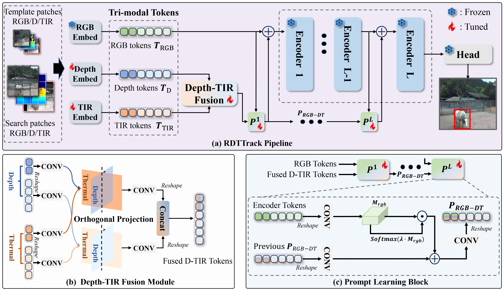

# Collaborating Vision, Depth, and Thermal Signals for Multi-Modal Tracking: Dataset and Algorithm
The official implementation of the multi-modal (Vision, Depth and Thermal Infrared) RDTTrack tracker of the paper **Collaborating Vision, Depth, and Thermal Signals for Multi-Modal Tracking: Dataset and Algorithm** \
## [**Dataset Website**](https://xuefeng-zhu5.github.io/RGBDT500/)

<center></center>


## Usage
### Installation

Install the environment using Anaconda
```
conda create -n rdttrack python=3.6
conda activate rdttrack
bash install_rdttrack.sh
cd /path/to/RDTTrack
```

### Data Preparation
The training/test dataset is the [**RGBDT500**](https://xuefeng-zhu5.github.io/RGBDT500/)
```
--RGBDT500
    |--Train
        |--001
            |--color
                |--000000001.png
                |--000000002.png
                ...
            |--depth
                |--000000001.png
                |--000000002.png
                ...            
            |--infrared
                |--000000001.png
                |--000000002.png
                ...                   
            |--ground_truth.txt           
        |--002
        ...
    |--Test
       |--001
            |--color
                |--000000001.png
                |--000000002.png
                ...
            |--depth
                |--000000001.png
                |--000000002.png
                ...            
            |--infrared
                |--000000001.png
                |--000000002.png
                ...                   
            |--ground_truth.txt      
       |--002
        ...
    ... 
```

### Set project paths
Run the following command to set paths for this project
```
python tracking/create_default_local_file.py --workspace_dir . --data_dir ./data --save_dir ./output
```

After running this command, you can also modify paths by editing these two files
```
lib/train/admin/local.py  # paths about training --> set self.rgbdt_dir
lib/test/evaluation/local.py  # paths about testing --> settings.rgbdt_test_dir
```

### Training
Dowmload the pretrained [foundation model](https://drive.google.com/drive/folders/1ttafo0O5S9DXK2PX0YqPvPrQ-HWJjhSy?usp=sharing) (OSTrack) 
and put it under ./pretrained/. Then modify the `MODEL.PRETRAIN_FILE` in `/path/to/RDTTrack/experiments/rdtt/baseline.yaml`.

Training with multiple GPUs using DDP (4 RTX3090Ti with batch size of 16)
```
export PYTHONPATH=/path/to/RDTTrack:$PYTHONPATH
python -m torch.distributed.launch --nproc_per_node=4 ./lib/train/run_training.py  
```
or using single GPU:
```
python ./lib/train/run_training.py  
```

### Test
Edit ./lib/test/evaluation/local.py to set the test set path, then run
```
python ./tracking/test.py
```

You can also use the [pre-trained model](https://drive.google.com/file/d/1I1z-GmZHkFNZuA2ACOJdSyw8bV-avfMI/view?usp=drive_link), 
and set the path (params.checkpoint) in ./lib/test/parameter/rdtt.py

### Evaluation
Please use our toolkit [Toolkit](https://github.com/xuefeng-zhu5/RGBDT500_Evaluation_Toolkit), and Run `run_tracker_performance_evaluation.m` in Matlab.

## Contact
If you have any question, please feel free to [contact us](xuefeng_zhu95@163.com)(xuefeng_zhu95@163.com)
